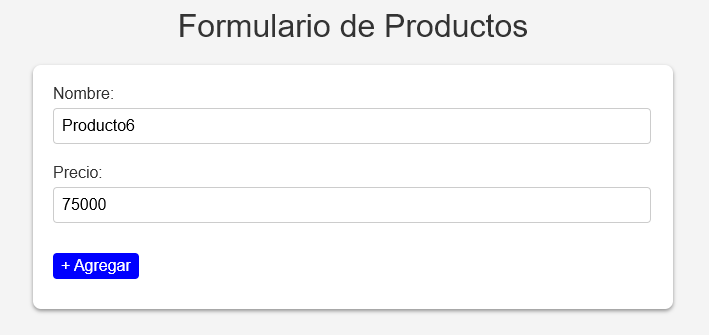

# Crud basico JAVA con SPRINGBOOT y mysql

## Primero debes crear una base de datos mysql, posteriormente modificas el archivo `src/main/resources/application.properties`

En este archivo debes configurar las credenciales y datos necesarios para acceder a tu base de datos, como la ruta, nombre de usuario y contraseña

Y para probar el programa ejecutas el archivo 
 `src/main/java/com/registro/CRUD/CrudApplication.java`